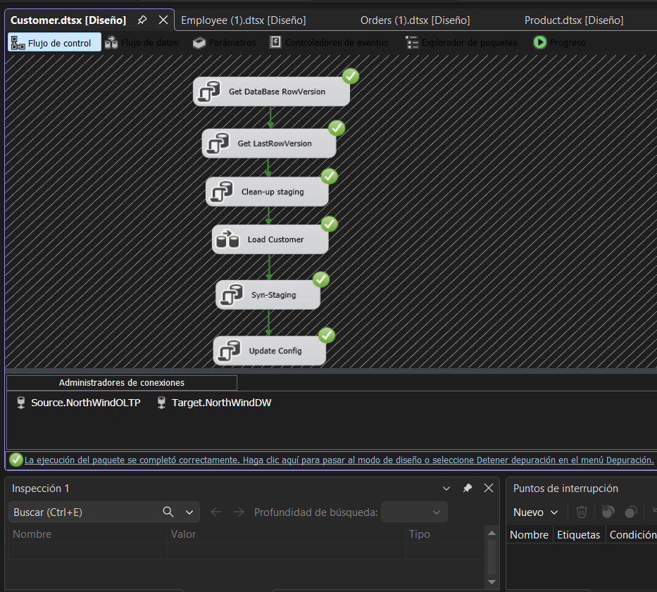
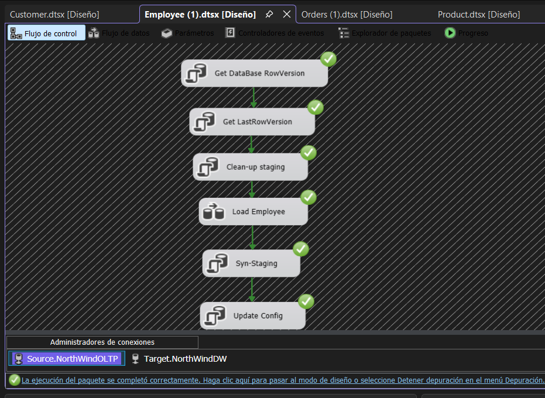
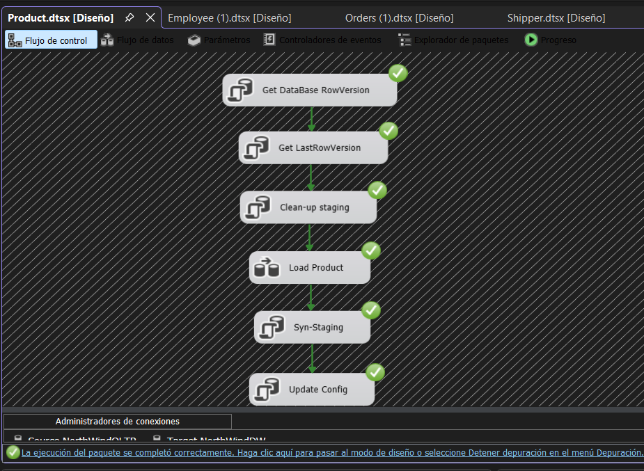
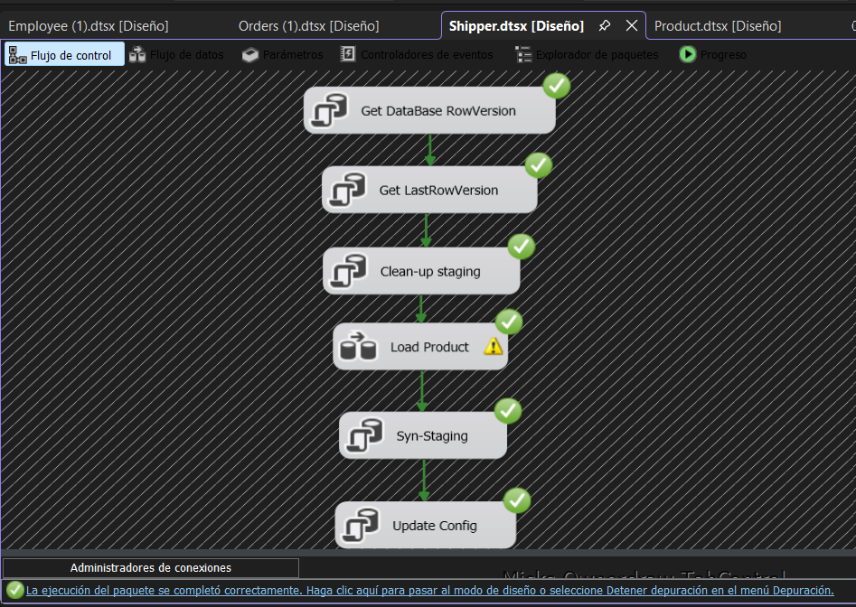
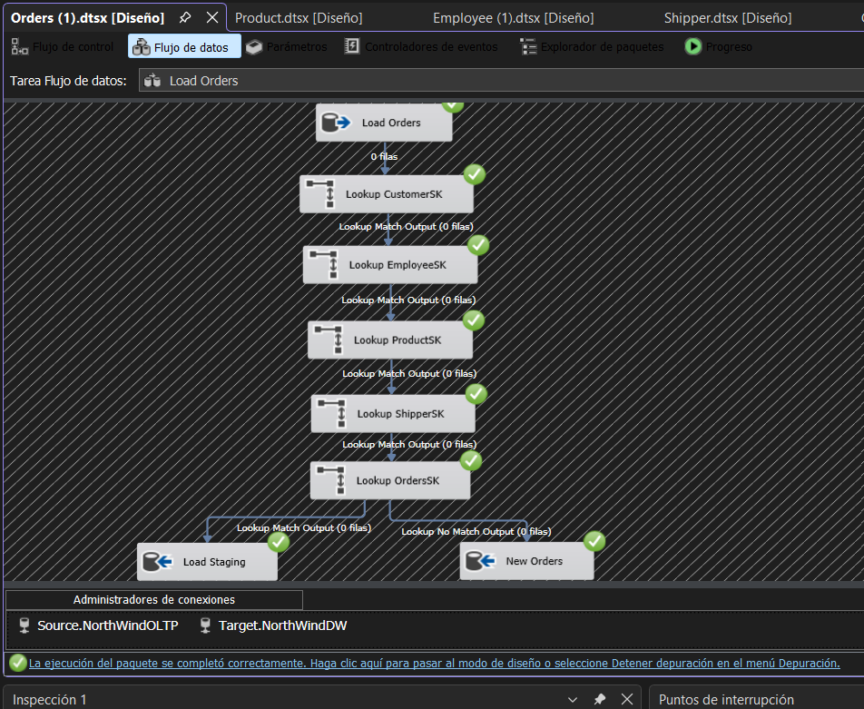

# Almacenamiento-y-preparacion-de-datos
Diplomado en Ciencias de Datos

INTEGRANTES:
- Humberto Lucana Mamani
- Michelle Quispe Choque

# Descripción del Proyecto

El proyecto consiste en el diseño e implementación de una base de datos transaccional (OLTP) y un Data Warehouse utilizando SQL Server basado en el caso de estudio de la base de datos NorthWind.

La base de datos permite trabajar con información relacionada a ventas de productos alimenticios a clientes (empresas y particulares) en múltiples países.

El objetivo principal es construir una arquitectura completa para análisis de datos, integrando:

- Base de datos OLTP
- Modelo dimensional tipo estrella
- Procesos ETL
- SQL Server Integration Services (SSIS)
- Visual Studio Community

Esto permitirá almacenar información transaccional y posteriormente transformarla en información analítica para reportes y toma de decisiones.

---

# Tecnologías Utilizadas

- Motor de Base de Datos: SQL Server 
- Administración: SQL Server Management Studio (SSMS)
- IDE de Desarrollo: Visual Studio Community 
- Herramienta ETL: SQL Server Integration Services (SSIS)
- Extensiones Adicionales: SQL Server Database Project
- Analysis Services Tabular Project
- Report Server Project

---

# Modelo de Datos y Diagramas

El diseño de la arquitectura de datos se divide en dos fases estructurales: el origen transaccional altamente normalizado y el destino analítico optimizado mediante un modelo multidimensional.

## Base de datos NorthWindOLTP (Modelo Transaccional)

La base de datos transaccional contiene tablas normalizadas en tercera forma normal mitigar la redundancia de datos y garantizar la integridad referencial en las operaciones diarias. Las principales tablas integradas son:

- Customers
- Orders
- Order Details
- Products
- Categories
- Suppliers
- Employees

Estas tablas están relacionadas mediante claves primarias y foráneas para mantener la integridad de los datos.


---

## Base de datos NorthWindDW (Data Warehouse)

Para optimizar el rendimiento de las consultas analíticas, se transformaron las estructuras transaccionales en un Modelo en Estrella. Este enfoque reduce el uso de uniones complejas (joins) y consolida la información histórica:

### Tabla de hechos

- FactSales, encargada de almacenar las métricas de negocio.

### Tablas dimensión

- DimDateDimensión de tiempo detallada que desglosa años, semestres, trimestres, meses y días de la semana.
- DimCustomer: Atributos demográficos y de contacto de clientes.
- DimProduct:  Detalles de productos, categorías y proveedores consolidados.
- DimEmployee: Jerarquías y datos del equipo de ventas.
- DimShipper: Información de las empresas de transporte de carga.
  

---
# Estrategia de Carga Incremental (Mecanismo ETL)

El núcleo del proyecto utiliza SQL Server Integration Services (SSIS) para implementar una solución de carga incremental robusta basada en diferenciales de RowVersion. En lugar de truncar y recargar millones de filas diariamente, el sistema detecta únicamente los registros nuevos o modificados en el origen desde la última ejecución registrada.

### Arquitectura del Flujo de Control (Control Flow)

Cada paquete implementado: Customer.dtsx, Employee.dtsx, Product.dtsx, Shipper.dtsx y Orders.dtsx cuenta con una infraestructura de sincronización estructurada en bloques de tareas secuenciales:

- Get DataBase Version / Get LastRowVersion: Consulta el estado actual de las tablas transaccionales del OLTP y recupera el parámetro límite de la última actualización exitosa desde una tabla de configuración intermedia.
- Clean Staging: Prepara y vacía las tablas de almacenamiento intermedio local (staging area).
- Data Flow Task (Carga principal):El bloque logico encargado del procesamiento y mapeo de datos en memoria.
- Syn-Staging: Sincroniza las estructuras locales con el destino analítico.
- Update Config: Actualiza la matriz de control de versiones con el nuevo punto de corte alcanzado para la siguiente ejecución cronológica.

---

# Evidencias de Ejecución 

Se adjuntan las capturas de pantalla de la herramienta de diseño e inspección en tiempo de ejecución, certificando la finalización en estado exitoso de los diferentes componentes del proyecto:

## Dimensión Clientes (Customer.dtsx)
Muestra el flujo de datos que clasifica a los clientes de la tienda, separando los registros nuevos de los que necesitan actualizarse.


## Dimensión Empleados (Employee.dtsx)
Muestra el proceso de carga en verde de la lista del equipo de ventas hacia el almacén de datos.


## Dimensión Productos (Product.dtsx)
Muestra la extracción de los productos, sus categorías y sus proveedores consolidados de forma incremental.


## Dimensión Transportistas (Shipper.dtsx)
Muestra la carga exitosa de las empresas encargadas de los envíos de carga de NorthWind.


## Paquete de Hechos (Orders.dtsx)
Validación del ciclo completo de sincronización, desde el análisis del rango de versiones de fila de la base de datos hasta la fase de actualización de configuración.


---

# Instrucciones de Implementacion y despliegue

## Requisitos

Instalar:

- SQL Server 
- SQL Server Management Studio (SSMS)
- Visual Studio Community 
- SQL Server Integration Services (SSIS) con las siguientes extensiones:
- SQL Server Database Project
- Analysis Services Tabular Project
- Report Server Project

---

## 1. Crear la base de datos OLTP

Abrir SQL Server Management Studio y ejecutar el archivo:

```sql
scriptOLTP.sql
```

Esto creará la base de datos:

```text
NorthWindOLTP
```

---

## 2. Crear el Data Warehouse

Ejecutar el archivo:

```sql
NorthWindDW.sql
```

Esto generará la base de datos:

```text
NorthWindDW
```

---

## 3. Configurar el proyecto en Visual Studio

1. Abrir Visual Studio Community y cargar la solución del proyecto (.sln)
2. En la parte inferior, modificar las propiedades de los Administradores de Conexiones (Source.NorthWindOLTP y Target.NorthWindDW).
3. Asegurarse de que el parámetro del servidor apunte a la instancia local de SQL Server y ejecutar.

---

## 4. Desplegar e implementar los paquetes SSIS
1. En el Explorador de Soluciones, hacer clic derecho sobre el nombre del proyecto SSIS y seleccionar la opción Implementar (Deploy).
2. Seguir el asistente de implementación seleccionando el servidor local como destino.
3. Guardar el proyecto dentro del catálogo central seguro SSISDB de SQL Server.
---

## 5. Automatización de la carga de datos
1. En sql server management, verificar que el servicio del Agente SQL Server (SQL Server Agent) esté iniciado (icono verde).
2. Hacer clic derecho sobre la carpeta Trabajos (Jobs) y seleccionar Nuevo trabajo por ejemplo CargaIncrementalNorthwind.
3. En la sección Pasos, agregar un elemento de tipo Catálogo de SQL server integration services apuntando al paquete de la solución.
4. En la seccion de programacion se define la frecuencia horaria o nocturna deseada para mantener el data Wwarehouse actualizado de manera automática.


